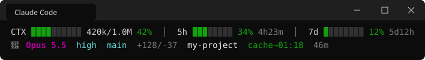
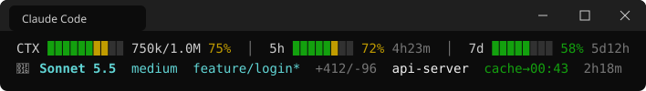
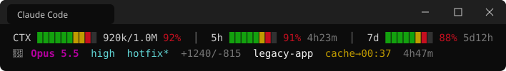
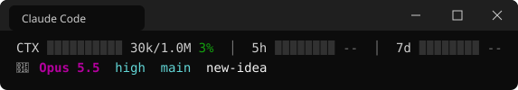

# claude-code-statusline-windows

[繁體中文](README.md) | **English**

[](LICENSE)
[](#installation)
[](https://www.python.org/)

A Windows-first status line for [Claude Code](https://code.claude.com/docs): two lines that show context usage, your 5-hour and 7-day limits, the model, the git branch, and when the prompt cache expires. Python standard library only — no jq, no bash.

Most status lines shared online are written for macOS in bash + jq, and on Windows one or two things always break: non-ASCII paths turn into mojibake, black console windows keep flashing, and projects on a cloud drive make git hang. This one is what I use on Windows every day, built by running into each of those problems.

## Preview

**Normal**: plenty of context and quota left; everything is green.



**Approaching the limit**: any bar at 65% or above turns yellow.



**About to run out**: 85% and above turns red.



**Session just started**: `--` until Claude Code sends limit data; if you've used it before, the last values seen are shown in the meantime.



As plain text (the real thing is in color):

```text
CTX ████░░░░░░ 420k/1.0M 42%  │  5h ███░░░░░ 34% 4h23m  │  7d █░░░░░░░ 12% 5d12h
🤖 Opus 5.5  high  main  +128/-37  my-project  cache→00:43  46m
```

## Features

| Feature | Description |
|---------|-------------|
| **CTX / 5h / 7d bars** | Line 1 shows the context window, the 5-hour limit, and the 7-day limit. Each cell is colored by the percentage it represents: green below 65%, yellow from 65%, red from 85% — so the fuller the bar, the warmer its tail. Uses basic ANSI colors only; no 24-bit color terminal required. Thresholds are configurable. |
| **Reset countdown** | Time until the limit resets, right after the percentage: `42m` under an hour, `4h25m` under a day, `5d21h` for a day or more (the usual format for the 7-day window). |
| **Context tokens** | `185k/1.0M`: tokens currently in context / context window size. |
| **Model name** | Colored by family (Opus magenta, Sonnet cyan, Haiku yellow). After `/model`, the name doesn't get stuck on the old model: the script reads the model ID of the latest reply from the transcript. Names are derived from the model ID (`claude-opus-5-5` → `Opus 5.5`), so new models need no lookup-table update. |
| **effort / fast badge** | Shows the current effort level (e.g. `high`) when extended thinking is on; shows `fast` instead when fast mode is on. |
| **agent / worktree indicator** | `agent:name` when running with `--agent`; `worktree:name` inside a worktree session. |
| **Git branch + uncommitted marker** | The branch name is read straight from `.git/HEAD`; a `*` is added when tracked files have uncommitted changes (untracked files don't count). The `*` result is cached for 5 seconds per repository. A detached HEAD shows the short SHA. |
| **Lines changed this session** | `+67/-17`, hidden when both are 0. |
| **Project folder name** | The folder Claude Code was launched in. |
| **Prompt cache expiry** | `cache→14:32` shows the *clock time* the cache expires: green with 5 minutes or more left, yellow with less than 5 (as of the last update), and `cache cold` once it has expired. Why not a countdown: the status line doesn't redraw every second — only on events such as a new reply or `/compact` finishing — so a countdown would sit on screen showing the wrong number, while a clock time stays correct. This field requires Claude Code v2.1.251 or later. |
| **Session elapsed time** | Formatted like `28m` or `1h05m`. |
| **Burn rate (optional)** | Shows `12k/min` (tokens per minute) after the 5h segment, so you can see the session is still consuming even when the limit percentage hasn't moved yet. Comes from [ccusage](https://github.com/ryoppippi/ccusage) and requires Node.js. Refreshed in the background every 5 minutes, so it never slows down rendering. |
| **Cost (optional)** | `$5.40`, yellow from $5, red from $10. Meant for API-billed users; this is Claude Code's estimate at list price and may differ from your actual bill. |
| **ASCII mode (optional)** | Uses `#` / `-` instead of block characters, `\|` as the separator, and drops the 🤖 icon, for terminals whose font can't render block characters. |

**Speed**: about 47 ms average startup (Windows 11, Python 3.14, mean of 10 consecutive runs with mock input, burn rate off). The run where the git `*` cache has expired and `git status` has to run again is slower.

## Why a Windows version

Each item below is a problem I actually hit on Windows. The function that handles it is in parentheses.

1. **stdin encoding**
   On Windows, Python decodes stdin with the system ANSI code page (cp1252, cp950, …) by default. The JSON Claude Code sends is UTF-8, so any Chinese or other non-ASCII character in a path comes out garbled.
   → Read raw bytes and decode them as UTF-8 ourselves. (`read_stdin()`)

2. **Output encoding**
   The console code page can't encode block characters like `█` and `░`, or emoji.
   → Skip the text layer and write UTF-8 bytes directly to stdout. (`main()`)

3. **Flashing black windows**
   Every refresh may start `git.exe` or `npx.cmd`, and these console programs flash a black window. Running the script itself with pythonw is not enough, because the console programs it starts allocate their own console.
   → Run the script with `pythonw.exe`, and start every child process with the `CREATE_NO_WINDOW` flag. (`NO_WINDOW`)

4. **`npx` is a batch file**
   On Windows, `npx` is really `npx.cmd`; calling plain `npx` from subprocess fails to find it.
   → Call `npx.cmd` explicitly on Windows. (`update_usage_cache()`)

5. **Cloud-synced folders make git hang**
   When a project lives on the Google Drive for desktop streaming drive, git can block forever inside a file-system call: it ignores kill, another one starts on every refresh, they pile up, and one may leave `.git/index.lock` behind, which then blocks your next commit.
   → Never start git on a cloud drive; read `.git/HEAD` for the branch name only (so no `*` is shown there). Google Drive is recognized by its volume label, "Google Drive". OneDrive folders (detected through the `OneDrive` family of environment variables) are skipped **as a precaution**: `git status` would trigger downloads of on-demand (Files On-Demand) files. (`is_cloud_path()`, `branch_from_head()`)

6. **Frequent polling without fighting over index.lock**
   The status line runs `git status` often; if one lands at the same moment as your own commit, you get an `index.lock` conflict.
   → Pass `--no-optional-locks` so the read-only status never creates `index.lock`. (`is_dirty()`)

7. **No jq, bash, or macOS-only commands**
   Many status lines depend on `jq`, bash syntax, or macOS's `stat -f`.
   → Python standard library only. If Python is installed, it runs.

8. **Stale cached limits**
   Claude Code doesn't send limit data until the first reply of each session, so this tool caches the last values and shows them in the meantime. Old numbers look exactly like correct ones, so the cache has two guards:
   - **Different account → discarded.** It compares the plan fields (on Windows the OAuth credentials are a plain file, `.credentials.json`, not the macOS Keychain) and the account ID that `/login` rewrites (stored only as a hash), so two accounts on the same plan are told apart too.
   - **Window already reset → discarded.** If a cached window's `resets_at` has passed, that limit has already gone back to zero, so its old percentage is not shown.
   → **It reads only the plan and account-ID fields, never the token.** (`account_fingerprint()`, `resolve_rate_limits()`)

9. **Floating-point noise**
   Percentages in the JSON are floats and occasionally show up as `7.000000000000001%`.
   → Round before display. (`fmt_pct()`)

## Installation

### Prerequisites

- Windows 11 (my environment). Windows 10 should work too, but I haven't tested it.
- Python 3.8 or later (the [python.org](https://www.python.org/downloads/windows/) installer includes `pythonw.exe`)
- [Claude Code](https://code.claude.com/docs)
- Optional: git (needed for the uncommitted `*` marker; the branch name alone doesn't need it)
- Optional: Node.js (needed for burn rate)

### Quick install

```powershell
git clone https://github.com/invokerdtw/claude-code-statusline-windows.git
cd claude-code-statusline-windows
python install.py --dry-run   # preview the changes; writes nothing
python install.py
```

No git? Use Download ZIP and run the same commands inside the extracted folder.

The installer:

1. Copies `statusline.py` to `%USERPROFILE%\.claude\statusline-windows\statusline.py`
2. Backs up `settings.json` (`settings.json.bak-statusline-<timestamp>`) and remembers your previous `statusLine` value, then writes the new setting
3. Uses the absolute path to `pythonw.exe` in the command; if a path contains spaces it uses the 8.3 short name instead, and if short names are disabled it writes the form your shell understands (Git Bash or PowerShell, depending on whether Git Bash is installed)
4. Keeps the original indentation and BOM of `settings.json`, changing only `statusLine`

A mistyped option or `--help` only prints usage; nothing is written.

Restart Claude Code for it to take effect.

To uninstall:

```powershell
python install.py --uninstall
```

Uninstalling restores your previous `statusLine` value (or removes the key if you had none) and deletes the `statusline-windows` folder and the default cache folder (a folder you chose with `CLAUDE_STATUSLINE_STATE_DIR` is never deleted). If you replaced the `statusLine` command with something else after installing, uninstall leaves your setting alone instead of overwriting it; extra keys such as `refreshInterval` do not count as a change. If your setting still runs a script inside the tool's folder, the folder is kept so you are not left with a setting that points to a missing file.

If you'd like an AI coding assistant to install it for you, point it to [INSTALL_FOR_AI.md](INSTALL_FOR_AI.md).

### Manual install

1. Copy `statusline.py` to `%USERPROFILE%\.claude\statusline-windows\`.

2. Find where Python is installed; `pythonw.exe` is in the same folder:

   ```powershell
   python -c "import sys; print(sys.executable)"
   ```

3. Edit `%USERPROFILE%\.claude\settings.json` and add (replace the paths with your own):

   ```json
   { "statusLine": { "type": "command", "command": "C:/Users/<you>/AppData/Local/Programs/Python/Python312/pythonw.exe \"C:/Users/<you>/.claude/statusline-windows/statusline.py\"" } }
   ```

4. Restart Claude Code.

Three details:

- **Use forward slashes `/` in paths**: on Windows, Claude Code runs this command through Git Bash when Git Bash is installed, and Git Bash treats unquoted backslashes as escape characters. The path separators get stripped and the command fails without a visible error (see the [official docs](https://code.claude.com/docs/en/statusline#windows-configuration)). Forward slashes work in both Git Bash and PowerShell.
- **Paths with spaces** (e.g. Python under `C:\Program Files\…`): with Git Bash, quoting both paths is enough. Without Git Bash, Claude Code runs the command through PowerShell, which needs a leading `& `: `& "C:/Program Files/…/pythonw.exe" "…/statusline.py"`. Otherwise PowerShell reports a syntax error and the status line stays blank. `install.py` handles this for you.
- **Use `pythonw.exe`, not `python.exe`**: `python.exe` is a console program; `pythonw.exe` doesn't open a console window, so nothing flashes when the status line refreshes.

## Configuration

All settings are environment variables. After setting one with `setx`, restart your terminal (and Claude Code) for it to take effect:

```powershell
setx CLAUDE_STATUSLINE_BURN_RATE 1
```

| Variable | Default | Description |
|----------|---------|-------------|
| `CLAUDE_STATUSLINE_WARN` | `65` | Turn yellow from this percentage |
| `CLAUDE_STATUSLINE_CRIT` | `85` | Turn red from this percentage |
| `CLAUDE_STATUSLINE_ASCII` | off | Set to `1` for plain-ASCII bars and separators, without emoji |
| `CLAUDE_STATUSLINE_BURN_RATE` | off | Set to `1` to show burn rate (requires Node.js; npx downloads a **pinned version** of ccusage on first run, never whatever is latest on npm. A failed fetch is retried after 5 minutes, not on every redraw) |
| `CLAUDE_STATUSLINE_SHOW_COST` | off | Set to `1` to show the estimated session cost |
| `CLAUDE_STATUSLINE_NO_GIT` | (empty) | Path prefixes where git is never started, separated by semicolons `;`, e.g. `D:\Shared;E:\Sync`. Matched by whole folder (`C:\Work` does not match `C:\Workspace`). Only the branch name is shown under these paths |
| `CLAUDE_STATUSLINE_GIT_IN_CLOUD` | off | Set to `1` to turn off the automatic Google Drive / OneDrive detection and run git on cloud drives too. Paths listed in `CLAUDE_STATUSLINE_NO_GIT` still never start git |
| `CLAUDE_STATUSLINE_STATE_DIR` | `%LOCALAPPDATA%\claude-code-statusline-windows` | Folder for the cache files (limits, git status, burn rate). Deliberately outside `.claude`: many people keep `.claude` in git, and machine-local caches should never end up in commits |

On/off variables accept `1`, `true`, `yes`, or `on`; set one to `0` to turn it off.

## How it works

When a session starts, and again on events such as a new reply or `/compact` finishing, Claude Code packs the current session state into JSON and passes it on stdin to the command in `statusLine`; whatever the command prints becomes the status line (see the [official docs](https://code.claude.com/docs/en/statusline)).

Usage, limits, countdowns, line counts, and times all come straight from that JSON; nothing is estimated locally. There are three exceptions: the model name is cross-checked against the transcript file, git status is read from your repository, and burn rate is computed by ccusage.

About the limit percentages: in my experience the 5-hour and 7-day percentages update in steps, roughly once every ten-plus minutes, not on every reply. If you want to see that you're still consuming, turn on burn rate.

## Testing

```powershell
python -m unittest discover tests   # unit tests
python examples/mock.py             # renders each scenario from mock data
python examples/mock.py danger      # just one scenario (normal / warning / danger / startup)
```

## License

MIT — see [LICENSE](LICENSE).

## Acknowledgements and inspiration

- [Claude Code status line docs](https://code.claude.com/docs/en/statusline): the reference for the JSON fields and when updates happen
- [kcchien/claude-code-statusline](https://github.com/kcchien/claude-code-statusline): a big influence on the layout and the preview section
- [ccstatusline](https://github.com/sirmalloc/ccstatusline)
- [ccusage](https://github.com/ryoppippi/ccusage): the source of the burn rate figure
